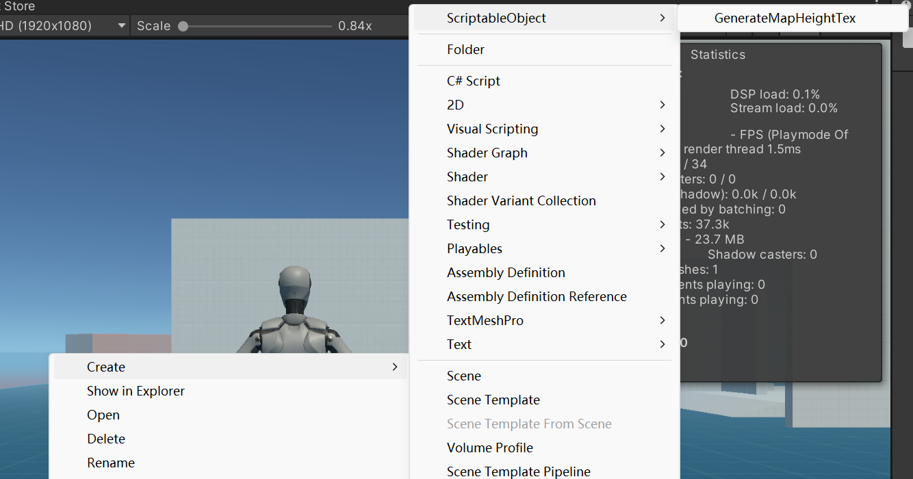
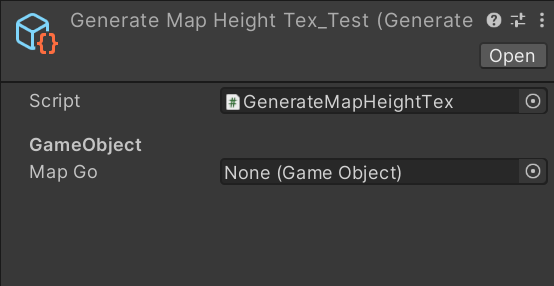
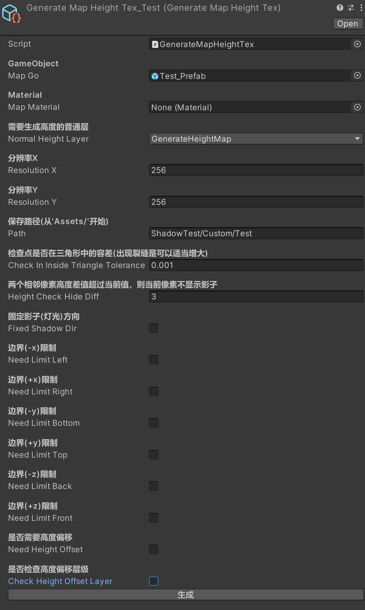
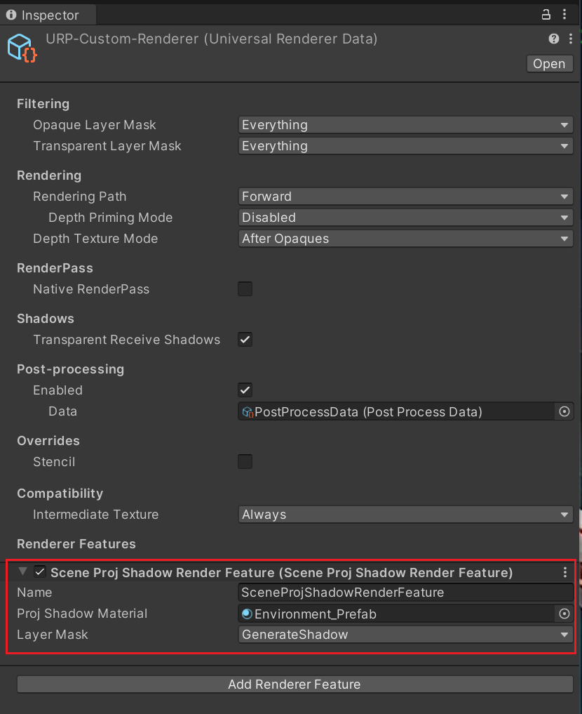
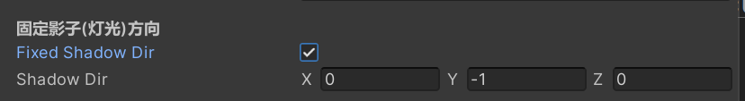
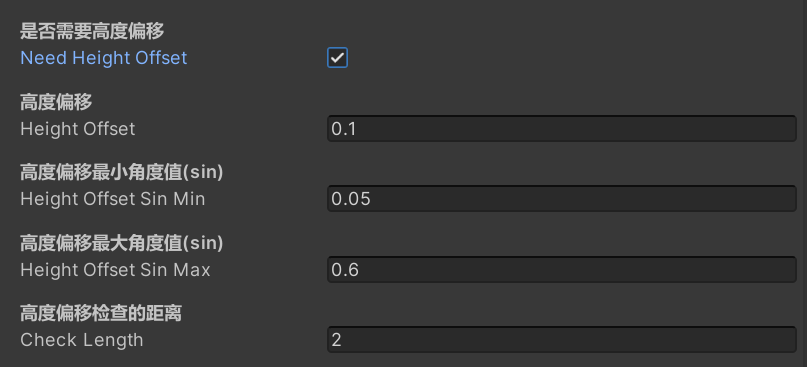

# 平坦地形固定镜头视角的影子绘制

## 两种方式对比
ProjectShadow不光需要一个额外的相机去 生成RT图，同时当前这种方式生成RT图时，每个需要影子的mesh都需要一个DrawCall（包括SetPassCall），而且生成影子时接受影子mesh中每个不能合批的都会增加一个DrawCall（包括SetPassCall）   
可以修改ProjectorShadowPass来实现SRPBatching批量绘制RT图，但后面生成影子的可能要修改投影器插件的逻辑（URP没有自带的投影器）

Custom方式，先在编辑器下生成一个贴图来近似当前场景的高度图，同时使用SRPBatching批量生成影子，根据数量不同会有几个SetPassCall（几千个mesh只需要三四个），每个需要影子的mesh需要一个DrawCall（但不包括SetPassCall）

### 性能数据对比
|                     |                            500个mesh                             |                             1000个mesh                             |                             2000个mesh                             |                             5000个mesh                              |                             10000个mesh                              |
|:-------------------:|:---------------------------------------------------------------:|:-----------------------------------------------------------------:|:-----------------------------------------------------------------:|:------------------------------------------------------------------:|:-------------------------------------------------------------------:|
|         无影子         |                    |                    |                    |                     |                    |
|       Custom        |           |           |           |            |           |
|  ProjectShadow_SRP  |  |  |  |   |  |
|    ProjectShadow    |          |          |          |           |          |

|            |                                                                                            |                                                                               |
|:----------:|:------------------------------------------------------------------------------------------:|:-----------------------------------------------------------------------------:|
|  500个mesh  |                    [Nop_500.mp4](Resources%2FNop%2FNop_500.mp4)<br/>无影子                    |       [Custom_500.mp4](Resources%2FCustom%2FCustom_500.mp4)<br/>Custom        |
|     \      |   [PS_SRP_500.mp4](Resources%2FProjectorShadow%2FPS_SRP_500.mp4) <br/> ProjectShadow_SRP   |   [PS_500.mp4](Resources%2FProjectorShadow%2FPS_500.mp4)!<br/>ProjectShadow   |
| 1000个mesh  |                   [Nop_1000.mp4](Resources%2FNop%2FNop_1000.mp4)<br/>无影子                   |      [Custom_1000.mp4](Resources%2FCustom%2FCustom_1000.mp4)<br/>Custom       |
|     \      |  [PS_SRP_1000.mp4](Resources%2FProjectorShadow%2FPS_SRP_1000.mp4) <br/> ProjectShadow_SRP  |  [PS_1000.mp4](Resources%2FProjectorShadow%2FPS_1000.mp4)!<br/>ProjectShadow  |
| 2000个mesh  |                   [Nop_2000.mp4](Resources%2FNop%2FNop_2000.mp4)<br/>无影子                   |      [Custom_2000.mp4](Resources%2FCustom%2FCustom_2000.mp4)<br/>Custom       |
|     \      |  [PS_SRP_2000.mp4](Resources%2FProjectorShadow%2FPS_SRP_2000.mp4) <br/> ProjectShadow_SRP  |  [PS_2000.mp4](Resources%2FProjectorShadow%2FPS_2000.mp4)!<br/>ProjectShadow  |
| 5000个mesh  |                   [Nop_5000.mp4](Resources%2FNop%2FNop_5000.mp4)<br/>无影子                   |      [Custom_5000.mp4](Resources%2FCustom%2FCustom_5000.mp4)<br/>Custom       |
|     \      |  [PS_SRP_5000.mp4](Resources%2FProjectorShadow%2FPS_SRP_5000.mp4) <br/> ProjectShadow_SRP  |  [PS_5000.mp4](Resources%2FProjectorShadow%2FPS_5000.mp4)!<br/>ProjectShadow  |
| 10000个mesh |                  [Nop_10000.mp4](Resources%2FNop%2FNop_10000.mp4)<br/>无影子                  |     [Custom_10000.mp4](Resources%2FCustom%2FCustom_10000.mp4)<br/>Custom      |
|     \      | [PS_SRP_10000.mp4](Resources%2FProjectorShadow%2FPS_SRP_10000.mp4) <br/> ProjectShadow_SRP | [PS_10000.mp4](Resources%2FProjectorShadow%2FPS_10000.mp4)!<br/>ProjectShadow |


## 使用
1. 创建生成高度图的Asset

   
   
   
2. 拖入需要生成高度图的Prefab，配置需要生成高度go的layer、分辨率、路径等，点击“生成”按钮生成材质球

   
3. 在Universal Renderer Data中添加Render Feature，将2生成的材质球拖到Proj Shadow Material，并配置需要生成阴影的Layer

   
4. （可选）固定灯光方向

   
5. （可选）针对复杂度高的地形，勾选“使用高度偏移”来缓解阴影因精度问题导致穿透到模型里的问题

   

## 实现思路
使用多线程计算缩短生成时间
### 第一种方式，垂直方向的高度图生成，可以旋转灯光方向（以不准确的方式估计）

#### 生成高度图
1. 处理场景mesh信息，遍历整个场景需要接收影子的mesh，将mesh的三角形各顶点转化到世界坐标系，并存储到meshInfoVoList中
    ```csharp
    var meshFilters = mapGo.GetComponentsInChildren<MeshFilter>();
    var meshInfoVoList = new NativeList<MeshInfoVo>(Allocator);
    foreach(var meshFilter in meshFilters) {
        var gameObject = meshFilter.gameObject;
        var normalLayer = ((1 << gameObject.layer) & normalHeightLayer.value) != 0;
        var offsetLayer = checkHeightOffsetLayer && ((1 << gameObject.layer) & heightOffsetLayer.value) != 0;
        
        if(!normalLayer && !offsetLayer) continue;
        
        var sharedMesh = meshFilter.sharedMesh;
        var curType = normalLayer ? TriangleType.Normal : TriangleType.Offset;
        for(var i = 0; i < sharedMesh.triangles.Length; i += 3) {
            meshInfoVoList.Add(new MeshInfoVo
            {
                Type = curType,
                MeshWordPos1 = meshFilter.transform.TransformPoint(sharedMesh.vertices[sharedMesh.triangles[i]]),
                MeshWordPos2 = meshFilter.transform.TransformPoint(sharedMesh.vertices[sharedMesh.triangles[i + 1]]),
                MeshWordPos3 = meshFilter.transform.TransformPoint(sharedMesh.vertices[sharedMesh.triangles[i + 2]]),
            });
        }
    }
    ```
2. HandleMeshVerticesJob()任务处理从1中获取到meshInfoVoList的三角形信息，存储到triangleInfoArray列表中，主要任务是生成三角形的边界信息及法线，并标记超过设置边界的三角形
   ```csharp
    // 三角形信息
    var triangleInfo = new TriangleInfo
    {
        Type = meshInfoVo.Type,
        Boundary = GetDefaultMapBoundary(),
        ConvertBoundary = GetDefaultMapBoundary(),
        WorldPos1 = meshInfoVo.MeshWordPos1,
        WorldPos2 = meshInfoVo.MeshWordPos2,
        WorldPos3 = meshInfoVo.MeshWordPos3,
    };
    // 计算法线
    triangleInfo.Normal = math.normalizesafe(math.cross(triangleInfo.WorldPos2 - triangleInfo.WorldPos1,
                    triangleInfo.WorldPos3 - triangleInfo.WorldPos2));
    // 生成边界信息
    CheckBounds(ref triangleInfo.Boundary, triangleInfo.WorldPos1);
    CheckBounds(ref triangleInfo.Boundary, triangleInfo.WorldPos2);
    CheckBounds(ref triangleInfo.Boundary, triangleInfo.WorldPos3);
   ```
3. 遍历从2得到的triangleInfoArray列表，将在边界内的三角形存储到usedTriangleInfoList中
   ```csharp
   // 处理生成的三角形信息
   var usedTriangleInfoList = new NativeList<TriangleInfo>(Allocator);
   foreach(var triangleInfo in triangleInfoArray) {
       if(triangleInfo.Type == TriangleType.Unavailable) continue;
       
       CheckBounds(ref mapBoundary, triangleInfo.Boundary);
       CheckBounds(ref convertMapBoundary, triangleInfo.ConvertBoundary);
   
       usedTriangleInfoList.Add(triangleInfo);
   }
   ```
4. CalculateHeightJob()任务计算场景高度，存到curHeightArray中
   ```csharp
    // 计算当前像素世界坐标
    var xIndex = index % ResolutionX;
    var yIndex = index / ResolutionX;
    var curPosX = Left + (0.5f + xIndex) * StepX;
    var curPosY = Back + (0.5f + yIndex) * StepY;
    var curPoint = new float3(curPosX, Bottom, curPosY);
    // ...
    // 遍历三角形列表，判断当前点是否在三角形y方向的投影内，是则计算高度
    foreach(var triangleInfo in TriangleInfoArray) {
        // 检测是否在三角形内
        if(!IsInsideTriangleMy(curConvertPoint,
               new float3(triangleInfo.WorldPos1.x, curPoint.y, triangleInfo.WorldPos1.z),
               new float3(triangleInfo.WorldPos2.x, curPoint.y, triangleInfo.WorldPos2.z),
               new float3(triangleInfo.WorldPos3.x, curPoint.y, triangleInfo.WorldPos3.z),
               CheckInInsideTriangleTolerance)) {
            continue;
            // ...
            // 计算高度
            var tempH = -((curPoint.x - tempPoint.x) * triangleInfo.Normal.x + (curPoint.z - tempPoint.z) * triangleInfo.Normal.z) /
                        triangleInfo.Normal.y + tempPoint.y - Bottom;
            // ...
        }
        // ... 存储高度到CurHeightArray
        CurHeightArray[index] = curHeightArray;
    }
   ```
   <details>
     <summary>IsInsideTriangleMy()实现</summary>
   
     ```csharp
     /// <summary>
     /// 是否在三角形内
     /// </summary>
     private static bool IsInsideTriangleMy(float3 point, float3 vertices1, float3 vertices2, float3 vertices3, float tolerance = 0.001f) {
         var pa = vertices1 - point;
         var pb = vertices2 - point;
         var pc = vertices3 - point;

         var pab = math.cross(pa, pb);
         var pbc = math.cross(pb, pc);
         var pca = math.cross(pc, pa);

         var d1 = math.dot(pab, pbc);
         var d2 = math.dot(pab, pca);
         var d3 = math.dot(pbc, pca);

         return d1 >= -tolerance && d2 >= -tolerance && d3 >= -tolerance;
     }
     ```
   </details>
5. CalculateHeightOtherJob()任务计算场景高度偏移及边界信息，分别存到curOffsetHeightArray和curEdgeHeightArray
   ```csharp
    if(NeedHeightOffset) {
        CurOffsetHeightArray[index] = CalculateCurHeightOffset(index, xIndex, yIndex, CurHeightArray, StepX, StepY, ConvertBottom, ResolutionX, ResolutionY, CheckLength, CheckHeightOffsetLayer, HeightOffsetSinMin, HeightOffsetSinMax, HeightOffset);
    }
    CurEdgeHeightArray[index] = CalculateCurHeightEdge(index, xIndex, yIndex, HeightCheckHideDiff, CurHeightArray, ConvertBottom, ResolutionX, ResolutionY);
   ```
   <details>
     <summary>CalculateCurHeightOffset()实现</summary>

     ```csharp
     // 计算最大两像素高度差的sin值
     for(var i = 1; i <= checkLength; i++) {
        if(xIndex - i >= 0) {
            CalculateCurSin(ref curSin, bottom, curH, checkHeightOffsetLayer, curHeightArray[index - i],
                stepX, heightOffsetSinMin, heightOffsetSinMax);
        }
        if(xIndex + i < resolutionX) {
            CalculateCurSin(ref curSin, bottom, curH, checkHeightOffsetLayer, curHeightArray[index + i],
                stepX, heightOffsetSinMin, heightOffsetSinMax);
        }
        if(yIndex - i >= 0) {
            CalculateCurSin(ref curSin, bottom, curH, checkHeightOffsetLayer, curHeightArray[index - i * resolutionX],
                stepY, heightOffsetSinMin, heightOffsetSinMax);
        }
        if(yIndex + i < resolutionY) {
            CalculateCurSin(ref curSin, bottom, curH, checkHeightOffsetLayer, curHeightArray[index + i * resolutionX], 
                stepY, heightOffsetSinMin, heightOffsetSinMax);
        }
     }
     // 根据sin值计算需要的偏移
     return curSin * heightOffset;
     ```
   </details>
   <details>
     <summary>CalculateCurHeightEdge()实现</summary>

   ```csharp
     // 检查左右上下两像素高度差是否大于设置的值checkHideDiff，大于则标记为边界
     for(var i = 1; i <= 2; i++) {
        if(xIndex - i >= 0 && math.abs(curH - curHeightArray[index - i].Height) > checkHideDiff || 
           yIndex - i >= 0 && math.abs(curH - curHeightArray[index - i * resolutionX].Height) > checkHideDiff) {
            return 1f;
        }
        if(xIndex + i < resolutionX && math.abs(curH - curHeightArray[index + i].Height) > checkHideDiff || 
           yIndex + i < resolutionY && math.abs(curH - curHeightArray[index + i * resolutionX].Height) > checkHideDiff) {
            return 1f;
        }
    }
     ```
   </details>
6. 保存材质球信息，把4中得到的curHeightArray(高度)存到r通道，curOffsetHeightArray(偏移)存到g通道，curEdgeHeightArray(边界)存到b通道
   ```csharp
   var pixelIndex = 0;
   for(var y = 0; y < resolutionY; y++) {
       for(var x = 0; x < resolutionX; x++) {
           texture2D.SetPixel(x, y,
               new Color( curHeightArray[pixelIndex].Height / high, curOffsetHeightArray[pixelIndex] / maxOffset, curEdgeHeightArray[pixelIndex]));
           pixelIndex++;
       }
   }
   ```

##### 绘制影子
1. 自定义RenderFeature、ShadowRenderPass
   ```csharp
   private readonly List<ShaderTagId> _mShaderTagIdList = new List<ShaderTagId>()
   {
       new ShaderTagId("UniversalForward")
   };
   // 创建自定义RenderFeature
   public override void Execute(ScriptableRenderContext context, ref RenderingData renderingData) {
       if (_overrideMaterial) {
           var drawingSettings = CreateDrawingSettings(_mShaderTagIdList, ref renderingData, SortingCriteria.CommonOpaque);
           
           drawingSettings.overrideMaterial = _overrideMaterial;
           //这里不需要所以没有直接写CommandBuffer，在下面Feature的AddRenderPasses加入了渲染队列，底层还是CB
           context.DrawRenderers(renderingData.cullResults, ref drawingSettings, ref _mFilteringSettings);
       }
   }
   ```
2. shader实现
* 顶点着色器代码vert
   ```shaderlab
   const float3 orig = v.vertex;
   //计算高度
   float3 target_pos = v.vertex;
   half3 y_axis;
   half3 height;
   
   y_axis = normalize(-_MainLightDir.xyz);
   height = sample_height(get_uv(target_pos.xz));;
 
   //面上的点
   target_pos.y = get_height(height.r);
   const float3 p = target_pos;
   //面的法线
   const float3 n = float3(0, 1, 0);
   //光的方向
   const float t = dot(orig - p, n) / dot(y_axis, n);
   v.vertex.xyz -= y_axis * t;

   //取投射点的高度，继续延光线方向投射两点高度差的一半（纯hack）
   height = sample_height(get_uv(v.vertex.xz));
   v.vertex.xyz -= y_axis * ((v.vertex.y - (height.r * _HeightTexHigh + _HeightTexBottom)) / 2);
   
   //逆光线方向添加偏移值
   v.vertex.xyz += (height.g * _MaxOffset + _LandHeightOffset) * y_axis;
   
   // 如果v.vertex在orig的逆光线那侧，则不显示
   o.uv.z = dot(y_axis, orig - v.vertex); // 如果需要更准确，可以把v.vertex传到frag，在frag里计算这段逻辑
   // 传递边界值到frag
   o.uv.w = height.b;
   ```
* 片元着色器代码frag
   ```shaderlab
   const half check_side = step(0, i.uv.z);		//检查生成点和原点的位置是否需要显示
   const half check_height = step(i.uv.w, 0.99);	//根据高度检查是否需要显示
   
   return half4(0, 0, 0, check_side * check_height * _Alpha);
   ```

### 第二种方式，根据灯光方向生成高度图，需要固定定光方向，比第一种方式更准确

#### 根据灯光方向生成高度图
基本流程和方式一一样，下面只讲不同点
1. 根据灯光方向计算从正交坐标系转换到光线坐标系的矩阵
   ```csharp
   var shadowMatrix = fixedShadowDir ? 
       new float3x3(
           1, -yAxis.x / yAxis.y, 0,
           0, 1 / yAxis.y, 0,
           0, -yAxis.z / yAxis.y, 1)
       : float3x3.identity;
   ```
2. HandleMeshVerticesJob()中，除了存储三角形世界坐标，还需要计算转换到光线坐标系的坐标，并计算边界值
   ```csharp
   // 三角形信息
   var triangleInfo = new TriangleInfo
   {
      ......
      // 计算并存储转换后的坐标
      ConvertWorldPos1 = math.mul(ShadowMatrix, meshInfoVo.MeshWordPos1),
      ConvertWorldPos2 = math.mul(ShadowMatrix, meshInfoVo.MeshWordPos2),
      ConvertWorldPos3 = math.mul(ShadowMatrix, meshInfoVo.MeshWordPos3)
   };
   
   ......
   
   // 计算边界值
   CheckBounds(ref triangleInfo.ConvertBoundary, triangleInfo.ConvertWorldPos1);
   CheckBounds(ref triangleInfo.ConvertBoundary, triangleInfo.ConvertWorldPos2);
   CheckBounds(ref triangleInfo.ConvertBoundary, triangleInfo.ConvertWorldPos3);
   ```
3. 计算高度值CalculateHeightJob()
   ```csharp
   // 当前像素点转化到新坐标系后的坐标
   var curConvertPoint = math.mul(ShadowMatrix, curPoint);
   
   foreach(var triangleInfo in TriangleInfoArray) {
       ......
       
      // 检测是否在三角形内
      if(!IsInsideTriangleMy(curConvertPoint,
            new float3(triangleInfo.ConvertWorldPos1.x, curConvertPoint.y, triangleInfo.ConvertWorldPos1.z),
            new float3(triangleInfo.ConvertWorldPos2.x, curConvertPoint.y, triangleInfo.ConvertWorldPos2.z),
            new float3(triangleInfo.ConvertWorldPos3.x, curConvertPoint.y, triangleInfo.ConvertWorldPos3.z),
            CheckInInsideTriangleTolerance)) {
         continue;
      }
      
      ....... 
       
      // 计算高度
      var tempH = -((curConvertPoint.x - tempPoint.x) * triangleInfo.Normal.x + (curConvertPoint.z - tempPoint.z) * triangleInfo.Normal.z) /
      triangleInfo.Normal.y + tempPoint.y - ConvertBottom;
   }
   ```
4. shader实现
* 顶点着色器代码vert
   ```shaderlab
   y_axis = normalize(-_ShadowDir.xyz);
   // 计算光线坐标系下的坐标
   target_pos = mul(half3x3(1, -y_axis.x / y_axis.y, 0,
                  0, 1 / y_axis.y, 0,
                  0, -y_axis.z / y_axis.y, 1), target_pos);
   // 将转换后的坐标x、z和_HeightTexBottom组成成新的坐标，并转换回原来的正交坐标系下，当作uv
   float3 uv_pos = mul(half3x3(1, y_axis.x, 0,
                  0, y_axis.y, 0,
                  0, y_axis.z, 1), float3(target_pos.x, _HeightTexBottom, target_pos.z));
   // 采样高度图 计算高度并赋值到target_pos.y
   height = sample_height(get_uv(uv_pos.xz));
   target_pos.y = get_height(height.r);
   
   // 将新得到光线坐标系下的坐标转换回原来的正交坐标系下，得到影子投射的点
   v.vertex.xyz = mul(half3x3(1, y_axis.x, 0,
                  0, y_axis.y, 0,
                  0, y_axis.z, 1), target_pos);
   ```
