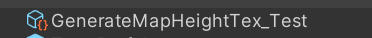
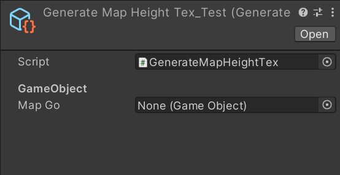

# 平坦地形固定镜头视角的影子绘制

## 两种方式对比
ProjectShadow不光需要一个额外的相机去 生成RT图，同时当前这种方式生成RT图时，每个需要影子的mesh都需要一个DrawCall（包括SetPassCall），而且生成影子时接受影子mesh中每个不能合批的都会增加一个DrawCall（包括SetPassCall）   
可以修改ProjectorShadowPass来实现SRPBatching批量绘制RT图，但后面生成影子的可能要修改投影器插件的逻辑（URP没有自带的投影器）

优化后的平面阴影Custom方式，先在编辑器下生成一个贴图来近似当前场景的高度图，同时使用SRPBatching批量生成影子，根据数量不同会有几个SetPassCall（几千个mesh只需要三四个），每个需要影子的mesh需要一个DrawCall（但不包括SetPassCall）

## 使用方式
1. 创建生成高度图的Asset

   
   
   
2. 拖入需要生成高度图的Prefab，配置需要生成高度go的layer、分辨率、路径等，点击“生成”按钮生成材质球

   
3. 在Universal Renderer Data中添加Render Feature，将2生成的材质球拖到Proj Shadow Material，并配置需要生成阴影的Layer

   
4. （可选）固定灯光方向

   
5. （可选）针对复杂度高的地形，勾选“使用高度偏移”来缓解阴影因精度问题导致穿透到模型里的问题

   